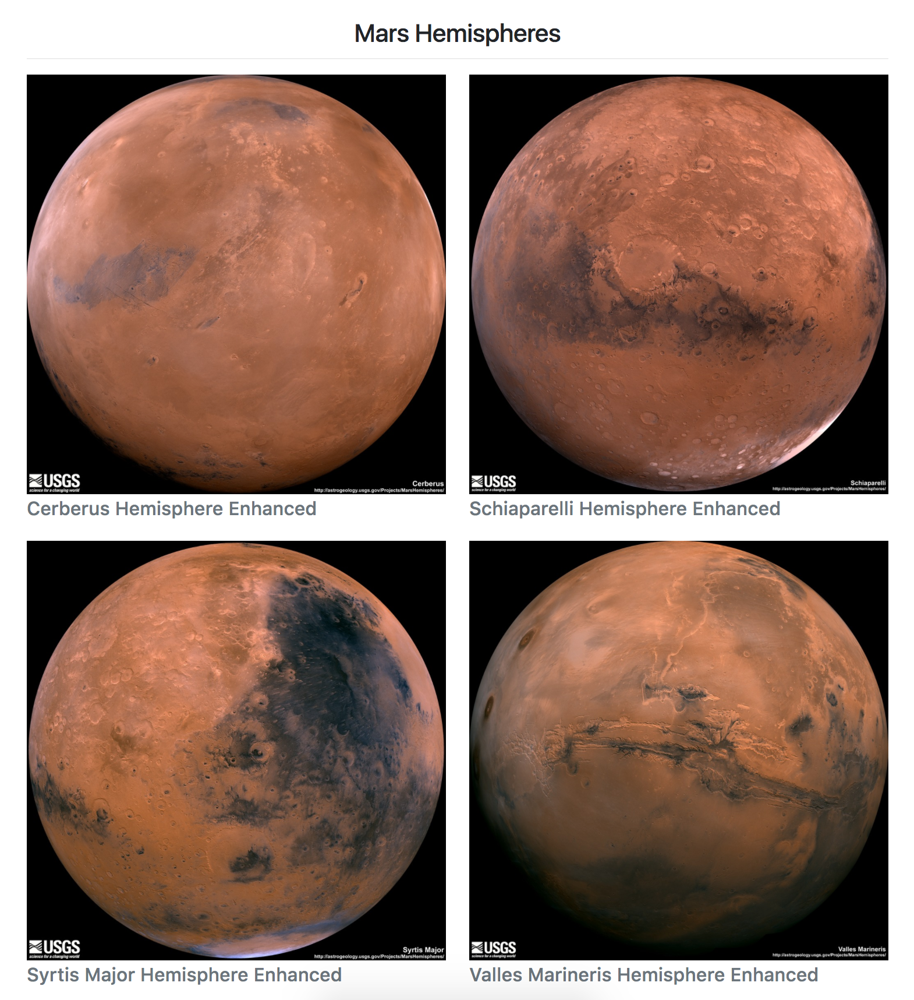

# Mission_To_Mars

# Objective
* Use BeautifulSoup and Splinter to automate a web browser and scrape high-resolution images.
* Use a MongoDB database to store data from the web scrape.
* Update the web application and Flask to display the data from the web scrape.
* Use Bootstrap to style the web app.

## System Prep
In order to run this application you will need to have Python version 3.6.3 installed on your system. If you do not have it installed then you can read about how to install it [here](https://docs.python.org/3/using/windows.html#installing-python).

You're also going to need MongoDB, an unstructured data storage management system, on your local system. In order to download and install it either follow the instructions [here](https://docs.mongodb.com/manual/installation/) or brew install it, only if you already have the brew package manager installed, using this code in your bash coding application:
```bash
$ brew update
$ brew install mongodb
```

##  Mars Hemispheres

